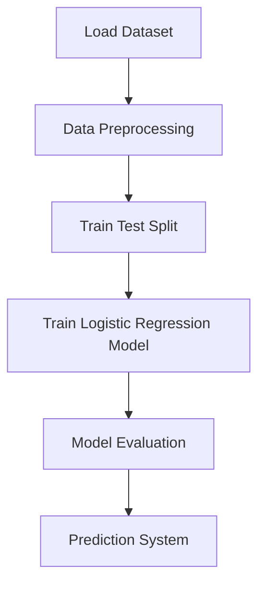

# 🚢 Rock vs Mine Prediction using Machine Learning


A **Machine Learning classification project** that predicts whether an object detected by **SONAR signals** is a **Rock or a Mine** using **Logistic Regression**.

This project demonstrates the implementation of a **complete ML workflow**, including:

* Data preprocessing
* Train-test split
* Model training
* Model evaluation
* Prediction system

---

# 📌 Quick Project Summary

| Feature      | Description                         |
| ------------ | ----------------------------------- |
| Problem Type | Binary Classification               |
| Algorithm    | Logistic Regression                 |
| Dataset      | SONAR Dataset                       |
| Features     | 60                                  |
| Samples      | 208                                 |
| Tools        | Python, Pandas, NumPy, Scikit-Learn |

---

# 📌 Project Overview

SONAR (Sound Navigation and Ranging) is used to detect underwater objects using sound signals.

The dataset contains **60 numerical signal features** representing sonar frequencies reflected from objects.

The goal is to classify objects as:

* **R → Rock**
* **M → Mine**

Using a **Machine Learning classification model**.

---

# 🧠 Machine Learning Workflow



This pipeline shows the **end-to-end ML process** implemented in this project.

---

# 📊 Dataset Information

Dataset used: **SONAR Dataset**

| Property       | Value              |
| -------------- | ------------------ |
| Total Samples  | 208                |
| Total Features | 60                 |
| Target Labels  | Rock (R), Mine (M) |
| Data Type      | Numerical Signals  |

Each row represents sonar signals bounced from an underwater object.

---

# ⚙️ Technologies Used

* **Python**
* **NumPy**
* **Pandas**
* **Scikit-Learn**
* **Jupyter Notebook**

---

# 🤖 Machine Learning Model

### Logistic Regression

Logistic Regression is a **supervised classification algorithm** used for binary classification problems.

In this project it predicts:

```
Rock
or
Mine
```

based on sonar signal patterns.

---

# 📈 Model Evaluation

The model performance is evaluated using:

* **Accuracy Score**

Evaluation is performed on:

* Training Data
* Testing Data

This ensures the model generalizes well on unseen data.

---

# 🔍 Prediction System

A predictive system is implemented where the model:

1️⃣ Accepts **60 sonar signal inputs**
2️⃣ Processes them using the trained model
3️⃣ Predicts whether the object is:

✔ **Rock**
✔ **Mine**

---

# 📂 Project Structure

```
Rock-vs-Mine-Prediction
│
├── rock_vs_mine_prediction.ipynb
├── sonar_data.csv
├── requirements.txt
├── README.md
```

---

# 🚀 How to Run the Project

### 1️⃣ Clone the Repository

```bash
git clone https://github.com/your-username/rock-vs-mine-prediction.git
```

### 2️⃣ Go to the Project Folder

```bash
cd rock-vs-mine-prediction
```

### 3️⃣ Install Required Libraries

```bash
pip install numpy pandas scikit-learn
```

### 4️⃣ Run the Notebook

Open **Jupyter Notebook** and execute all cells.

---

# 🎯 Skills Demonstrated

* Machine Learning
* Data Preprocessing
* Logistic Regression
* Data Analysis using Pandas
* Model Evaluation
* Predictive System Development

---

# 👨‍💻 Author

**Taksh Samirkumar Patel**

Computer Science Engineering Student
Interested in **Artificial Intelligence | Machine Learning | Data Science**

🔗 LinkedIn
https://www.linkedin.com/in/taksh-patel-6a6b97325

💻 LeetCode
https://leetcode.com/u/5EWSbJZA6M/

---

⭐ If you like this project, consider giving it a **star**!
